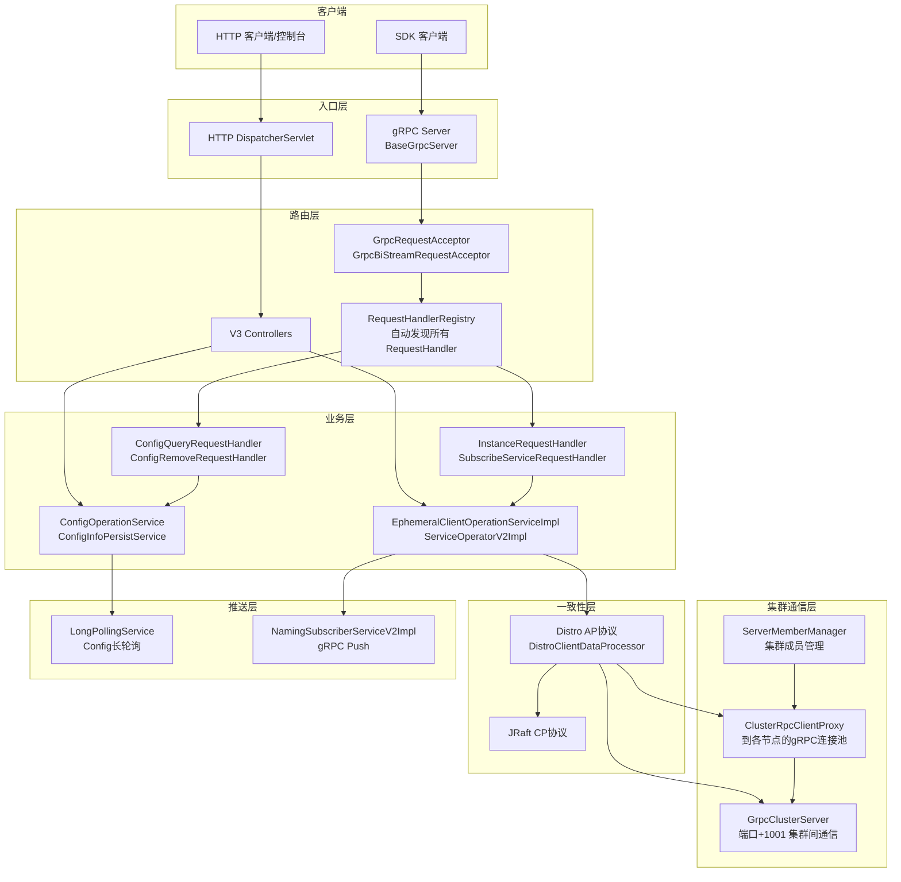
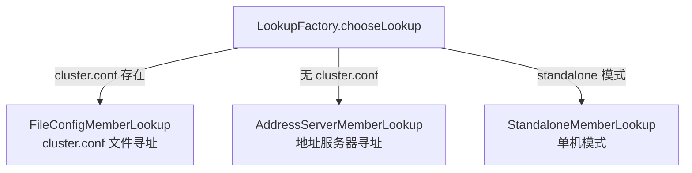

# Nacos v3 核心逻辑阅读指南

> 从启动壳到业务逻辑 — 完整的代码阅读路径

---

## 概述

`NacosBootstrap` 只是启动壳，做了三件事：创建 Spring 容器 → 注册 Bean → 启动 gRPC/HTTP Server。
服务跑起来后，所有业务逻辑都由 **请求驱动** 或 **事件驱动**。



---

## 一、gRPC 入口 → 核心逻辑（SDK 直连主通道）

这是最主要的通信方式，SDK 通过 gRPC 直连服务端。

### 链路步骤

| 步骤 | 类 | 文件位置 | 作用 |
|------|-----|---------|------|
| ① 端口监听 | `BaseGrpcServer` | `core/.../remote/grpc/BaseGrpcServer.java` | 启动两个端口：SDK(主端口+1000)、Cluster(主端口+1001)，注册拦截器和Service |
| ② 请求接收 | `GrpcRequestAcceptor.request()` | `core/.../remote/grpc/GrpcRequestAcceptor.java` | 一元调用入口：解析 Payload → 找 Handler → 校验连接 → 委托执行 |
| ③ 流式请求 | `GrpcBiStreamRequestAcceptor.requestBiStream()` | `core/.../remote/grpc/GrpcBiStreamRequestAcceptor.java` | 双向流入口：处理 ConnectionSetupRequest（客户端注册）+ Response（ACK回调） |
| ④ Handler 查找 | `RequestHandlerRegistry.getByRequestType()` | `core/.../remote/RequestHandlerRegistry.java` | **关键！** 在 ContextRefreshedEvent 时扫描所有 RequestHandler Bean，按泛型类型类名建立索引 |
| ⑤ 执行 | `RequestHandler.handleRequest()` | `core/.../remote/RequestHandler.java` | 应用 RequestFilters 链 → 调用子类 handle() |

### 按业务模块的 Handler

**Config 模块：**

| Handler | 文件位置 | 作用 |
|---------|---------|------|
| `ConfigQueryRequestHandler` | `config/.../remote/ConfigQueryRequestHandler.java` | 配置查询（含灰度匹配） |
| `ConfigRemoveRequestHandler` | `config/.../remote/ConfigRemoveRequestHandler.java` | 配置删除 |

**Naming 模块：**

| Handler | 文件位置 | 作用 |
|---------|---------|------|
| `InstanceRequestHandler` | `naming/.../handler/InstanceRequestHandler.java` | 实例注册/注销 |
| `BatchInstanceRequestHandler` | `naming/.../handler/BatchInstanceRequestHandler.java` | 批量实例操作 |
| `SubscribeServiceRequestHandler` | `naming/.../handler/SubscribeServiceRequestHandler.java` | 服务订阅 |
| `ServiceListRequestHandler` | `naming/.../handler/ServiceListRequestHandler.java` | 服务列表查询 |

---

## 二、HTTP 入口 → 核心逻辑（兼容旧 SDK + 控制台）

### 链路步骤

| 步骤 | 类 | 作用 |
|------|-----|------|
| ① Controller | 各类 `*ControllerV3` | 校验参数 → 委托 Service |
| ② Service | 各类 `*Service` | 核心业务逻辑 |
| ③ Persist | 各类 `*PersistService` | 数据持久化（Derby/MySQL/PostgreSQL） |
| ④ Notify | `NotifyCenter` / `ConfigChangePublisher` | 发布事件 → 触发推送 |

### 各业务模块对应关系

```
Config:   ConfigControllerV3  →  ConfigOperationService  →  ConfigInfoPersistService  →  LongPollingService (推送)
Naming:   InstanceControllerV3 →  InstanceOperatorClientImpl → EphemeralClientOperationServiceImpl → ClientManager → Distro (集群同步)
          ServiceControllerV3  →  ServiceOperatorV2Impl   →  NamingMetadataOperateService
```

### 以配置发布为例的完整链路

```
ConfigControllerV3.publishConfig()                             ← HTTP入口
    ↓
ConfigOperationService.publishConfig()                         ← 参数校验、灰度/标签分流
    ↓
ConfigInfoPersistService.insertOrUpdate()                      ← 写数据库（支持CAS乐观锁）
    ↓
ConfigChangePublisher.notifyConfigChange(
    new ConfigDataChangeEvent(...))                             ← 发事件
    ↓
NotifyCenter → LongPollingService 的 DataChangeTask            ← 唤醒长轮询客户端
```

---

## 三、配置变更如何推送给客户端

这是最经典的后台机制，分两种模式：

### Config: HTTP 长轮询模式

`LongPollingService` (`config/.../service/LongPollingService.java`) 在构造时就注册了通知机制：

```
LongPollingService 构造:
    ① 启动 StatTask（每10秒统计长轮询客户端数）
    ② 注册 LocalDataChangeEvent 的 Subscriber
    ③ Subscriber.onEvent() → DataChangeTask → 遍历 allSubs 队列
       → 匹配 groupKey → client.sendResponse() → 返回HTTP 200

客户端请求 → addLongPollingClient() → AsyncContext挂起(hold 29秒)
                                    → 超时返回空 / 有变更立即返回
```

### Naming: gRPC 主动推送

`NamingSubscriberServiceV2Impl` (`naming/.../push/v2/NamingSubscriberServiceV2Impl.java`) 继承 `SmartSubscriber`，监听 `ServiceChangeEvent` → 通过 gRPC 双向流推送给订阅客户端：

```
Service变更 → ClientOperationEvent → NamingSubscriberServiceV2Impl.onEvent()
    → 查找所有订阅该服务的客户端
    → dispatchAndExecuteTask() → gRPC push
```

---

## 四、启动后自动触发的后台任务

这些不是由请求驱动，而是服务器跑起来之后就持续运行的：

| 任务 | 所在类 | 触发方式 | 作用 |
|------|--------|---------|------|
| 过期客户端清理 | `ConnectionBasedClientManager.ExpiredClientCleaner` | `scheduleWithFixedDelay(5s)` | 心跳超时断开客户端连接 |
| 集群成员信息上报 | `ServerMemberManager.infoReportTask` | `scheduleByCommon(2s)` 自循环 | 定时向其他节点报告自身状态 |
| 不健康成员检测 | `ServerMemberManager.unhealthyMemberInfoReportTask` | `scheduleByCommon(5s)` 自循环 | 检测并上报不健康节点 |
| Distro 数据校验 | `DistroClientDataProcessor` | DistroProtocol 驱动 | 集群间校验客户端数据一致性，不一致则全量同步 |
| Config 长轮询统计 | `LongPollingService.StatTask` | `scheduleWithFixedDelay(10s)` | 打印长轮询客户端数量 |
| 性能日志 | `PerformanceLoggerThread` | `@PostConstruct` + `@Scheduled` | 每分钟打印服务/IP/订阅数/推送耗时 |
| 指标采集 | `PerformanceLoggerThread.collectMetrics()` | `@Scheduled(cron="0/15 *")` | 每15秒采集 serviceCount/avgPushCost |
| 模糊 Watch 清理 | `ConfigFuzzyWatchContextService.init()` | `scheduleWithFixDelay(30s)` | 清理过期的模糊匹配上下文 |
| Naming任务分发 | `NamingExecuteTaskDispatcher` | 单例内置引擎 | 异步执行命名服务各类任务（推送、索引更新等） |
| 客户端索引管理 | `ClientServiceIndexesManager` | `SmartSubscriber` | 监听客户端注册/注销事件，维护 service→client 索引 |
| Controller TPS 注册 | `HttpTpsPointRegistry.onApplicationEvent()` | `ContextRefreshedEvent` 回调 | 扫描所有 HTTP 接口的 `@TpsControl` 注解，建立 TPS 监控点 |

---

## 五、建议的阅读路径（按"一条主线"方式）

与其按模块一个个读，不如按**一条业务主线**从头追到尾：

### 路线 1：服务注册全链路（推荐先读这个，最典型）

```
起点: InstanceRequestHandler.handle()
  ① EphemeralClientOperationServiceImpl.registerInstance()
     → 校验实例合法性 → 查找/创建 Service 单例 → 获取 Client → 添加 Instance
  ② client.addServiceInstance(singleton, instanceInfo)
     → client.recalculateRevision()  ← 版本号递增
  ③ NotifyCenter.publishEvent(ClientRegisterServiceEvent)
     ↓ 关键分叉点：
     ├→ ClientServiceIndexesManager：更新 service→clients 索引
     ├→ NamingSubscriberServiceV2Impl：gRPC 推送给订阅者
     └→ DistroClientDataProcessor.onEvent()：
         └→ DistroProtocol.sync(distroKey, CHANGE)  ← 同步到集群其他节点
             └→ 其他节点的 DistroClientDataProcessor.processData()
                 → handlerClientSyncData() → 更新本地 Client
```

### 路线 2：配置发布全链路

```
起点: ConfigControllerV3.publishConfig()  （HTTP）或 gRPC ConfigPublishRequestHandler
  ① ConfigOperationService.publishConfig()
     → beta发布分流 / tag发布分流 / 正式发布
     → ConfigInfoPersistService.insertOrUpdate()  ← 写数据库
  ② ConfigChangePublisher.notifyConfigChange(ConfigDataChangeEvent)
     ↓
  ③ NotifyCenter 分发：
     ├→ 异步dump任务（ConfigCacheService）
     ├→ IstioConfigChangeEvent（如果是istio配置）
     └→ LocalDataChangeEvent → LongPollingService.DataChangeTask
         → 遍历 allSubs → 匹配 groupKey → sendResponse() → HTTP返回
```

### 路线 3：服务发现 / 订阅推送全链路

```
起点: SubscribeServiceRequestHandler.handle()
  ① EphemeralClientOperationServiceImpl.subscribeService()
     → client.addServiceSubscriber(singleton, subscriber)
  ② NotifyCenter.publishEvent(ClientSubscribeServiceEvent)
     ↓
  ③ NamingSubscriberServiceV2Impl.onEvent()
     → 计算需要推送的 Service 变更
     → dispatchAndExecuteTask() → 异步 gRPC Push

后续：当有实例变更时
  ④ NamingSubscriberServiceV2Impl.onEvent(ServiceChangeEvent)
     → 查找所有订阅了该 Service 的 ConnectionBasedClient
     → 通过 gRPC BiStream 推送给客户端
```

---

## 六、阅读技巧总结

| 技巧 | 说明 |
|------|------|
| **跟事件走** | Nacos 的核心是**事件驱动**。在 Handler/Service 中找到 `NotifyCenter.publishEvent()` → 找对应的 `SmartSubscriber` → 理解事件怎么被消费 |
| **跟 Distro 走** | Naming 临时实例的数据一致性靠 Distro AP 协议。看到 `distroProtocol.sync()` → 追到 `DistroClientDataProcessor.processData()` 看远端怎么接收 |
| **跟长轮询走** | Config 的推送靠 `LongPollingService`。构造时注册的 `LocalDataChangeEvent` Subscriber 是整个推送的枢纽 |
| **入口 → Service → 持久化 → 通知** | 几乎所有业务都遵循这个四步模式，记住这个模板就能快速定位任何功能 |

---

## 七、Nacos 集群机制详解

Nacos 集群模式下的核心能力包括：**节点发现、成员管理、节点间通信（Cluster gRPC Channel）、AP 数据同步（Distro）和 CP 一致性（JRaft）**。

### 7.1 集群整体架构

```
┌─────────────────────────────────────────────────────────────────┐
│                         Nacos 节点                                │
│                                                                  │
│  主端口 8848 (HTTP)                                               │
│  ├── GrpcSdkServer (8848 + 1000 = 9848)     ← 客户端连接         │
│  │   └── GrpcRequestAcceptor + GrpcBiStreamRequestAcceptor       │
│  └── GrpcClusterServer (8848 + 1001 = 9849)  ← 集群间通信        │
│      └── 同样注册了 Handler，但 Source 校验限集群内部             │
│                                                                  │
│  ClusterRpcClientProxy (gRPC Client 连接池)                       │
│  ├── Cluster-{ip:port} → Member A  ← 到节点A的 gRPC 连接         │
│  ├── Cluster-{ip:port} → Member B  ← 到节点B的 gRPC 连接         │
│  └── Cluster-{ip:port} → Member C  ← 到节点C的 gRPC 连接         │
│                                                                  │
│  ProtocolManager                                                  │
│  ├── APProtocol (Distro)  ← 临时实例同步                         │
│  └── CPProtocol (JRaft)   ← 持久实例一致性                        │
└─────────────────────────────────────────────────────────────────┘
```

**端口分工：**

| 端口 | 偏移量 | 服务 | 用途 |
|------|--------|------|------|
| 主端口 (8848) | 0 | HTTP Server | 控制台 API、兼容旧 SDK、健康检查 |
| SDK gRPC | `+1000` | [GrpcSdkServer](file:///Users/mmhm/IdeaProjects/nacos/core/src/main/java/com/alibaba/nacos/core/remote/grpc/GrpcSdkServer.java) | 客户端 gRPC 请求（注册/发现/配置） |
| Cluster gRPC | `+1001` | [GrpcClusterServer](file:///Users/mmhm/IdeaProjects/nacos/core/src/main/java/com/alibaba/nacos/core/remote/grpc/GrpcClusterServer.java) | **集群节点间通信**（成员报告、Distro 同步、Raft 投票） |

两个 gRPC Server 都继承自 [BaseGrpcServer](file:///Users/mmhm/IdeaProjects/nacos/core/src/main/java/com/alibaba/nacos/core/remote/grpc/BaseGrpcServer.java)，公用 `GrpcRequestAcceptor` 和 `GrpcBiStreamRequestAcceptor`。区别在于 `getSource()` 返回值不同：

- `GrpcSdkServer.getSource()` → `LABEL_SOURCE_SDK`，受理客户端请求
- `GrpcClusterServer.getSource()` → `LABEL_SOURCE_CLUSTER`，只受理集群内部请求

`RequestHandlerRegistry` 会根据 `@InvokeSource` 注解进行**来源校验**，确保集群内部 Handler（如 `MemberReportHandler`、`DistroDataRequestHandler`）只接受集群来源的请求。

---

### 7.2 节点发现（MemberLookup）

Nacos 支持三种节点发现模式，由 `nacos.core.member.lookup.type` 或自动选择：



#### FileConfigMemberLookup（文件寻址）

[FileConfigMemberLookup](file:///Users/mmhm/IdeaProjects/nacos/core/src/main/java/com/alibaba/nacos/core/cluster/lookup/FileConfigMemberLookup.java) 从 `${nacos.home}/conf/cluster.conf` 读取集群 IP 列表，每行一个 `ip:port`：

```
192.168.1.10:8848
192.168.1.11:8848
192.168.1.12:8848
```

核心机制：
- 启动时读取 `cluster.conf` → 解析为 `Member` 列表 → 调用 `memberManager.memberChange()`
- 使用 `WatchFileCenter` (inotify) 监控文件变化，配置变更时自动重新加载

#### AddressServerMemberLookup（地址服务器寻址）

[AddressServerMemberLookup](file:///Users/mmhm/IdeaProjects/nacos/core/src/main/java/com/alibaba/nacos/core/cluster/lookup/AddressServerMemberLookup.java) 从外部地址服务器 HTTP 拉取集群列表：

- 启动时发起 HTTP GET 到 `http://{domain}:{port}/{context}/serverlist`，最多重试 5 次
- 之后每 5 秒定时同步一次（`AddressServerSyncTask`）
- 连续失败 12 次后标记 `addressServerHealth = false`

#### StandaloneMemberLookup（单机）

[StandaloneMemberLookup](file:///Users/mmhm/IdeaProjects/nacos/core/src/main/java/com/alibaba/nacos/core/cluster/lookup/StandaloneMemberLookup.java) 单机模式下使用，只包含自身节点。

#### 如何选择

[LookupFactory.chooseLookup()](file:///Users/mmhm/IdeaProjects/nacos/core/src/main/java/com/alibaba/nacos/core/cluster/lookup/LookupFactory.java#L124) 的决策逻辑：

1. 先读配置 `nacos.core.member.lookup.type` 显式指定
2. 否则检查 `cluster.conf` 文件是否存在或 `nacos.member.list` 环境变量是否有值 → `FILE_CONFIG`
3. 都不满足 → `ADDRESS_SERVER`

---

### 7.3 成员管理与状态维护

[ServerMemberManager](file:///Users/mmhm/IdeaProjects/nacos/core/src/main/java/com/alibaba/nacos/core/cluster/ServerMemberManager.java) 是集群节点管理的**核心 Bean**。

#### 启动初始化流程

```
ServerMemberManager 构造函数 → init()
    ① 确定自身端口和地址 → 构建 self Member
    ② 初始化 self 的 ServerAbilities（通过 SPI 发现）
    ③ serverList.put(self.getAddress(), self)
    ④ 注册 NotifyCenter：
        ├── 注册 MembersChangeEvent Publisher
        └── 注册 IPChangeEvent Subscriber（IP 变化时自动更新本地地址）
    ⑤ initAndStartLookup() → 选择 Lookup 并启动
```

#### 成员状态报告（心跳机制）

集群模式下，两个定时任务持续运行：

| 任务 | 周期 | 策略 | 通信方式 |
|------|------|------|---------|
| `MemberInfoReportTask` | 2秒自循环 | **轮询**：每 2 秒向集群中**一个**成员报告（cursor 递增取模） | 优先 gRPC（`ClusterRpcClientProxy.sendRequest`），降级 HTTP |

**通信协议选择逻辑：** `MemberInfoReportTask.executeBody()` 中先检查目标节点的 `grpcReportEnabled`：

1. **gRPC 方式（优先）**：`reportByGrpc()` 通过 `ClusterRpcClientProxy.sendRequest(member, MemberReportRequest)` 发送
2. **HTTP 方式（降级）**：`reportByHttp()` 使用 `asyncRestTemplate.post()` 发送到 `/cluster/report`，失败后尝试升级为 gRPC

每个报告包含完整的 `Member` 信息：IP、端口、状态、版本号、扩展信息（权重、站点等）、ServerAbilities。

**接收端处理：** [MemberReportHandler](file:///Users/mmhm/IdeaProjects/nacos/core/src/main/java/com/alibaba/nacos/core/cluster/remote/MemberReportHandler.java) 接收报告：
```java
// 标注只接受集群来源
@InvokeSource(source = {RemoteConstants.LABEL_SOURCE_CLUSTER})
public MemberReportResponse handle(MemberReportRequest request, RequestMeta meta) {
    node.setState(NodeState.UP);   // 标记为健康
    node.setFailAccessCnt(0);      // 重置失败计数
    memberManager.update(node);    // 更新本地集群视图
}
```

#### 不健康节点持续探测

[UnhealthyMemberInfoReportTask](file:///Users/mmhm/IdeaProjects/nacos/core/src/main/java/com/alibaba/nacos/core/cluster/ServerMemberManager.java#L677) 每 5 秒向所有 `!UP` 状态的节点重试报告，一旦节点恢复 → `update()` 更新状态 → 状态变更为 UP。

#### 成员信息更新

当某节点报告了新的成员信息：
```
MemberInfoReportTask → memberManager.update(newMember)
    → serverList.computeIfPresent(address, (s, member) -> { ... })
    → 如果基础信息变更（IP/port/状态等）→ notifyMemberChange(member)
        → NotifyCenter.publishEvent(MembersChangeEvent)
```

#### 成员变更事件链

`MembersChangeEvent` 的监听者：

| 监听者 | 作用 |
|--------|------|
| [ClusterRpcClientProxy](file:///Users/mmhm/IdeaProjects/nacos/core/src/main/java/com/alibaba/nacos/core/cluster/remote/ClusterRpcClientProxy.java) | 创建/销毁到新老成员的 gRPC 连接 |
| [ProtocolManager](file:///Users/mmhm/IdeaProjects/nacos/core/src/main/java/com/alibaba/nacos/core/distributed/ProtocolManager.java) | 通知 AP/CP 协议层成员变化（单线程池异步，保证顺序） |
| [DistroMapper](file:///Users/mmhm/IdeaProjects/nacos/naming/src/main/java/com/alibaba/nacos/naming/core/DistroMapper.java) | Naming 模块的 Distro 责任分片映射 |

---

### 7.4 集群间数据通信（Cluster gRPC Channel）

这是集群节点间通信的**核心通道**。

#### 连接池管理

[ClusterRpcClientProxy](file:///Users/mmhm/IdeaProjects/nacos/core/src/main/java/com/alibaba/nacos/core/cluster/remote/ClusterRpcClientProxy.java) 为每个集群成员维护一个 **gRPC Client 连接**：

```java
// 启动时初始化所有成员的 gRPC 客户端
@PostConstruct
public void init() {
    NotifyCenter.registerSubscriber(this);  // 监听 MembersChangeEvent
    List<Member> members = serverMemberManager.allMembersWithoutSelf();
    refresh(members);  // 为每个成员创建 Cluster-{address} 的 RpcClient
}

// 成员变更时动态调整
@Override
public void onEvent(MembersChangeEvent event) {
    refresh(serverMemberManager.allMembersWithoutSelf());
    // 新成员 → createRpcClientAndStart()
    // 离开的成员 → shutdown() 并移除
}
```

每个连接的建立流程：
```java
createRpcClientAndStart(member, ConnectionType.GRPC) {
    labels.put(LABEL_SOURCE, LABEL_SOURCE_CLUSTER);   // 标记为集群来源
    RpcClient client = RpcClientFactory.createClusterClient(
        "Cluster-" + member.getAddress(),             // 唯一标识
        ConnectionType.GRPC,
        GrpcClientConfig.newBuilder()...build());      // 配置连接参数
    
    client.serverListFactory(() -> member.getAddress()); // 固定目标地址
    client.start();  // 建立 gRPC 连接（双向流）
}
```

#### 通信模式

`ClusterRpcClientProxy` 提供三种通信方式：

| 方法 | 说明 |
|------|------|
| `sendRequest(member, request)` | 同步发送到指定成员，超时 3 秒 |
| `asyncRequest(member, request, callback)` | 异步发送到指定成员，带回调 |
| `sendRequestToAllMembers(request)` | 广播到所有其他成员 |

所有请求在发送前都会 `injectorServerIdentity()` 注入鉴权信息。

#### 接收端：GrpcClusterServer

[GrpcClusterServer](file:///Users/mmhm/IdeaProjects/nacos/core/src/main/java/com/alibaba/nacos/core/remote/grpc/GrpcClusterServer.java) 监听 `主端口 + 1001`，同样注册了 `GrpcRequestAcceptor`，但 `grpcCommonRequestAcceptor` 在处理前会校验来源：

```java
// BaseGrpcServer.handleCommonRequest() 中：
if (!invokeSourceAllowCheck(grpcRequest)) {
    // 拒绝非集群来源的请求
}
```

这意味着集群内部 Handler（如 `MemberReportHandler`、`DistroDataRequestHandler`）标注了 `@InvokeSource(source = LABEL_SOURCE_CLUSTER)`，**只能从 Cluster 端口进来**，SDK 端口连接无法调用。

#### 集群间核心 Handler

| Handler | 所在模块 | 作用 |
|---------|---------|------|
| [MemberReportHandler](file:///Users/mmhm/IdeaProjects/nacos/core/src/main/java/com/alibaba/nacos/core/cluster/remote/MemberReportHandler.java) | core | 接收其他节点的成员信息报告 |
| [DistroDataRequestHandler](file:///Users/mmhm/IdeaProjects/nacos/naming/src/main/java/com/alibaba/nacos/naming/remote/rpc/handler/DistroDataRequestHandler.java) | naming | 接收 Distro 数据同步（SYNC/VERIFY/QUERY/SNAPSHOT） |

---

### 7.5 Distro AP 协议（Naming 临时实例数据同步）

Distro 协议负责 Naming 模块**临时实例（ephemeral instance）** 的集群间数据同步，提供**最终一致性**。

#### 组件注册

[DistroClientComponentRegistry.doRegister()](file:///Users/mmhm/IdeaProjects/nacos/naming/src/main/java/com/alibaba/nacos/naming/consistency/ephemeral/distro/v2/DistroClientComponentRegistry.java#L66) 在 `@PostConstruct` 时注册：

```
DistroClientComponentRegistry.doRegister()
    ├── DistroClientDataProcessor  ← 数据处理器 + 存储
    ├── DistroClientTransportAgent ← 传输代理（通过 ClusterRpcClientProxy）
    └── DistroClientTaskFailedHandler ← 失败重试处理
```

#### 数据同步流程

```
本节点服务注册变更
    → DistroClientDataProcessor.onEvent(ClientEvent)
        → distroProtocol.sync(distroKey, CHANGE)  ← 触发同步
    
DistroProtocol.sync()
    → 遍历 allMembersWithoutSelf()
        → syncToTarget(distroKey, action, member.address, delay)
            → 创建 DistroDelayTask 放入 DelayTaskExecuteEngine
                → DistroClientTransportAgent.syncData(data, targetServer)
                    → DistroDataRequestHandler.handle()  ← 远端接收
                        → distroProtocol.onReceive(distroData)
                            → DistroClientDataProcessor.processData()
                                → handlerClientSyncData()
```

#### 周期性数据校验（Verify）

[DistroProtocol.startVerifyTask()](file:///Users/mmhm/IdeaProjects/nacos/core/src/main/java/com/alibaba/nacos/core/distributed/distro/DistroProtocol.java#L89) 启动定时校验任务：

```
DistroVerifyTimedTask → 定时向每个节点发送 VERIFY 请求
    → DistroClientDataProcessor.getVerifyData()  ← 生成校验数据（clientId + revision）
    → DistroClientTransportAgent.syncVerifyData()
        → 远端 DistroClientDataProcessor.processVerifyData()
            → clientManager.verifyClient(verifyData)  ← 比对 revision
                → 一致：返回成功
                → 不一致：返回失败 → 触发 DistroClientDataProcessor.syncToVerifyFailedServer()
                    → 全量同步该 client 的数据
```

#### 快照（Snapshot）

启动时新节点从其他节点拉取全量数据：

```
DistroLoadDataTask → 随机选一个节点 → getDatumSnapshot()
    → DistroClientDataProcessor.getDatumSnapshot()
        → 返回所有 ephemeral client 的全量数据
```

---

### 7.6 JRaft CP 协议（持久实例一致性）

#### 协议管理

[ProtocolManager](file:///Users/mmhm/IdeaProjects/nacos/core/src/main/java/com/alibaba/nacos/core/distributed/ProtocolManager.java) 负责 CP 协议的生命周期管理：

- **懒初始化：** 首次调用 `getCpProtocol()` 时才初始化 JRaft
- **同步初始化：** 使用 `synchronized(cpLock)` 保证单次初始化
- **成员注入：** 每个成员的 Raft 端口 = `IP + ":" + calculateRaftPort(member)`

#### 端口计算

```
Raft 端口 = 主端口 + 1000 - 2 × Raft端口偏移量
```

其中 Raft 端口偏移量取 `nacos.core.member.meta.raft-port`（默认值由 `MemberUtil.calculateRaftPort` 计算）。

#### 成员变更通知

当集群成员发生变化时：

```
MembersChangeEvent
    → ProtocolManager.onEvent()
        → ProtocolExecutor.apMemberChange(() → apProtocol.memberChange(...))
        → ProtocolExecutor.cpMemberChange(() → cpProtocol.memberChange(...))
```

**关键设计：** AP 和 CP 的成员变更在**不同的单线程池**中执行，互不阻塞，保证顺序处理。

#### JRaft 能力

基于 [SOFAJRaft](https://github.com/sofastack/sofa-jraft)，提供：

- **Leader 选举** — PreVote + 多数派投票
- **日志复制** — Leader 将写操作复制到 Follower
- **快照** — 定期快照压缩日志
- **配置变更** — 成员加入/离开时自动调整 Raft Group

---

### 7.7 集群通信整体链路图

```mermaid
graph TB
    subgraph NodeA[节点 A 192.168.1.10:8848]
        SMMA[ServerMemberManager]
        CRPA[ClusterRpcClientProxy]
        GCSA[GrpcClusterServer :9849]
        DP[DistroProtocol]
    end

    subgraph NodeB[节点 B 192.168.1.11:8848]
        SMMB[ServerMemberManager]
        CRPB[ClusterRpcClientProxy]
        GCSB[GrpcClusterServer :9849]
    end

    SMMA -->|MemberInfoReportTask<br/>每2秒轮询报告| CRPA
    CRPA -->|gRPC: MemberReportRequest<br/>通过 Cluster-{ip:port} 连接| GCSB
    GCSB -->|MemberReportHandler.handle()| SMMB
    SMMB -->|update() → MembersChangeEvent| SMMB
    
    DP -->|sync(CHANGE)| CRPA
    CRPA -->|gRPC: DistroDataRequest| GCSB
    GCSB -->|DistroDataRequestHandler.handle()| DP

    SMMA -.->|订阅 MembersChangeEvent| CRPA
    SMMB -.->|订阅 MembersChangeEvent| CRPB
```

---

## 总结

**不要从启动代码开始读业务逻辑。** 记住三条主线（服务注册、配置发布、订阅推送），每个主线按"入口 → Service → 持久化 → 通知推送"的四步模板去追，就能快速理解 Nacos 的核心运作机制。

理解集群机制时，抓住两个关键通道：
- **Cluster gRPC Channel (主端口 + 1001)**：集群节点间所有的状态报告、数据同步、Raft 投票都走这条通道
- **MembersChangeEvent 事件链**：成员变更通知 ProtocolManager（AP/CP 协议）、ClusterRpcClientProxy（连接池）、DistroMapper（分片）三条支线
