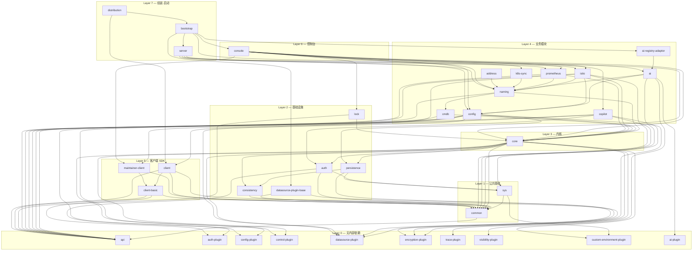

# Nacos 模块依赖关系图

> 基于 60 个 `pom.xml` 解析，版本 `3.3.0-SNAPSHOT`，仅统计内部 `nacos-*` 依赖。

---

## 一、分层依赖总览（Mermaid 图）



---

## 二、逐模块依赖明细

### Layer 0：无内部依赖（13 个）

这些模块不依赖任何其他 Nacos 模块，是整个系统的基石。

| 模块 | 分类 | 说明 |
|------|------|------|
| `api` | 接口定义 | gRPC proto、API 模型（`Result<T>`）、异常定义 |
| `auth-plugin` | 插件 SPI | 鉴权插件接口 |
| `config-plugin` | 插件 SPI | 配置变更插件接口 |
| `control-plugin` | 插件 SPI | 控制插件接口 |
| `datasource-plugin` | 插件 SPI | 数据源方言接口 |
| `encryption-plugin` | 插件 SPI | 加密插件接口 |
| `trace-plugin` | 插件 SPI | 链路追踪接口 |
| `visibility-plugin` | 插件 SPI | 可见性插件接口 |
| `custom-environment-plugin` | 插件 SPI | 自定义环境变量接口 |
| `ai-plugin` | 插件 SPI | AI 流水线接口 |
| `log4j2-adapter` | 日志适配 | Log4j2 日志适配器 |
| `logback-adapter-12` | 日志适配 | Logback 1.2 日志适配器 |
| `plugin` | 聚合 POM | 所有插件 SPI 的父 POM（无代码） |
| `plugin-default-impl` | 聚合 POM | 所有默认插件实现的父 POM（无代码） |

### Layer 1：公共基础（2 个）

| 模块 | 依赖 | 说明 |
|------|------|------|
| `common` | `api` | 通用工具：HTTP 客户端、NotifyCenter 事件总线、线程池 |
| `sys` | `common`, `custom-environment-plugin` | JVM 参数管理、环境变量、Bean 去重 PostProcessor |

### Layer 2：基础设施（5 个）

| 模块 | 依赖 | 说明 |
|------|------|------|
| `consistency` | `common` | 一致性协议抽象层（JRaft CP + Distro AP） |
| `persistence` | `consistency`, `datasource-plugin`, `sys` | 数据持久化抽象（Derby/MySQL/PostgreSQL） |
| `auth` | `auth-plugin`, `common`, `sys` | 认证授权核心（RBAC、JWT、Token） |
| `lock` | `api`, `core` | ⚠️ 分布式锁（循环依赖 `core`） |
| `datasource-plugin-base` | `common`, `datasource-plugin` | 数据源插件基础实现 |

### Layer 3：内核（1 个）

| 模块 | 依赖 | 说明 |
|------|------|------|
| `core` | `auth`, `common`, `config-plugin`, `consistency`, `control-plugin`, `custom-environment-plugin`, `datasource-plugin`, `encryption-plugin`, `persistence`, `trace-plugin` | **整个系统的中枢**：集群管理、启动生命周期、命名空间管理、远程连接 |

### Layer 4：业务模块（10 个）

| 模块 | 依赖 | 说明 |
|------|------|------|
| `naming` | `api`, `cmdb`, `core` | 服务注册与发现（Distro 协议同步、健康检查） |
| `config` | `api`, `config-plugin`, `control-plugin`, `core`, `datasource-plugin`, `datasource-plugin-derby`, `datasource-plugin-mysql`, `datasource-plugin-oracle`, `datasource-plugin-postgresql`, `encryption-plugin`, `persistence` | 配置管理（发布、监听、灰度、长轮询） |
| `cmdb` | `api`, `core` | CMDB 元数据管理 |
| `ai` | `ai-plugin`, `common`, `config`, `naming`, `visibility-plugin` | AI 资源注册中心（Prompt、MCP、A2A） |
| `ai-registry-adaptor` | `ai` | AI 注册适配器 |
| `copilot` | `api`, `auth`, `common`, `maintainer-client`, `sys` | Copilot AI 助手集成 |
| `istio` | `api`, `client`, `common`, `config`, `core`, `naming` | Istio 服务网格集成 |
| `prometheus` | `api`, `core`, `naming` | Prometheus 监控指标暴露 |
| `k8s-sync` | `naming` | Kubernetes 服务同步 |
| `address` | `naming` | 地址服务器（DNS 模式） |

### Layer 5：客户端 SDK（3 个）

| 模块 | 依赖 | 说明 |
|------|------|------|
| `client-basic` | `api`, `auth-plugin`, `common` | 客户端基础 SDK（Java 8 兼容） |
| `client` | `api`, `client-basic`, `common`, `encryption-plugin`, `log4j2-adapter`, `logback-adapter-12` | 完整客户端 SDK（配置+服务发现） |
| `maintainer-client` | `client-basic`, `common` | 运维客户端（内部使用） |

### Layer 6：控制台（1 个）

| 模块 | 依赖 | 说明 |
|------|------|------|
| `console` | `ai`, `config`, `copilot`, `core`, `default-plugin-all`, `istio`, `k8s-sync`, `lock`, `maintainer-client`, `naming`, `prometheus` | **Web Console 后端**：聚合所有业务模块 + 所有默认插件实现 |

### Layer 7：组装与启动（3 个）

| 模块 | 依赖 | 说明 |
|------|------|------|
| `server` | `config`, `default-plugin-all`, `istio`, `naming`, `prometheus` | **两个 Spring Boot 入口**：`NacosServerBasicApplication` + `NacosServerWebApplication`，Bean 分流 |
| `bootstrap` | `ai-registry-adaptor`, `console`, `core`, `datasource-plugin-base`, `default-plugin-all`, `server` | **万物起点**：`NacosBootstrap.main()` 创建父子 Context |
| `distribution` | `bootstrap`, `client`, `default-plugin-all` | 打包分发（bin/conf/ 目录） |

### 辅助模块

| 模块 | 依赖 | 说明 |
|------|------|------|
| `example` | `client`, `common`, `core` | 示例代码 |
| `logger-adapter-impl` | `common` | 日志适配聚合 POM |
| `test` | (无) | 测试聚合 POM |

---

## 三、默认插件实现

所有默认实现位于 `plugin-default-impl/` 下：

| 子模块 | 依赖 | 说明 |
|--------|------|------|
| `default-auth-plugin` | (待确认) | 默认鉴权实现（RBAC + JWT） |
| `ldap-auth-plugin` | `core`, `sys` | LDAP 鉴权 |
| `oidc-auth-plugin` | `auth-plugin`, `common`, `core`, `sys` | OIDC 鉴权 |
| `default-control-plugin` | (待确认) | 默认控制插件 |
| `default-ai-importer-plugin` | `ai-plugin`, `api`, `common` | AI 资源导入 |
| `default-ai-pipeline-plugin` | `ai-plugin`, `common` | AI 流水线 |
| `default-ai-trace-plugin` | `common`, `trace-plugin` | AI 追踪 |
| `datasource-plugin-derby` | `datasource-plugin-base` | Derby 方言 |
| `datasource-plugin-mysql` | `datasource-plugin-base` | MySQL 方言 |
| `datasource-plugin-postgresql` | `datasource-plugin-base` | PostgreSQL 方言 |
| `datasource-plugin-oracle` | `datasource-plugin-base` | Oracle 方言 |
| `default-plugin-all` | 所有上述插件 | **一键聚合所有默认插件** |

---

## 四、反向查询：谁依赖我？

如果你想改某个模块，需要知道会影响谁：

| 被依赖模块 | 下游模块（直接依赖者） |
|------------|----------------------|
| `api` | `client`, `client-basic`, `cmdb`, `common`, `config`, `copilot`, `example`, `istio`, `lock`, `naming`, `prometheus` |
| `common` | `ai`, `auth`, `client`, `client-basic`, `config-plugin`, `consistency`, `control-plugin`, `copilot`, `core`, `custom-environment-plugin`, `datasource-plugin`, `datasource-plugin-base`, `encryption-plugin`, `example`, `istio`, `maintainer-client`, `sys`, `trace-plugin`, `visibility-plugin` |
| `core` | `bootstrap`, `cmdb`, `config`, `console`, `example`, `istio`, `lock`, `naming`, `prometheus` |
| `naming` | `address`, `ai`, `console`, `istio`, `k8s-sync`, `prometheus`, `server` |
| `config` | `ai`, `console`, `istio`, `server` |
| `sys` | `auth`, `copilot`, `persistence` |
| `auth` | `copilot`, `core` |
| `consistency` | `core`, `persistence` |
| `persistence` | `config`, `core` |
| `client` | `distribution`, `example`, `istio` |
| `client-basic` | `client`, `maintainer-client` |
| `auth-plugin` | `auth`, `client-basic` |

---

## 五、关键洞察

### 5.1 依赖层级深度

```
api (深度 0)
 └─ common (深度 1)
     └─ sys, consistency, persistence, auth, ... (深度 2)
         └─ core (深度 3)
             └─ naming, config, cmdb (深度 4)
                 └─ console, ai, istio, ... (深度 5)
                     └─ server (深度 6)
                         └─ bootstrap (深度 7)
                             └─ distribution (深度 8)
```

最深依赖链：`distribution → bootstrap → server → config → core → persistence → consistency → common → api`（8 层）

### 5.2 核心依赖枢纽

- **`api`**：被 11 个模块直接依赖，是系统最底层的接口契约
- **`common`**：被 18 个模块直接依赖，是最广泛使用的公共库（含 NotifyCenter）
- **`core`**：被 9 个模块直接依赖，承载启动生命周期、集群管理
- **`naming`** 和 **`config`**：被 7 个模块各依赖，是两个核心业务域

### 5.3 注意点

1. **`lock` 模块存在循环依赖**：`lock → core` 但 `core` 不直接依赖 `lock`，无需担心
2. **`config` 的依赖最多样**：它同时依赖具体的数据库方言实现（derby/mysql/oracle/postgresql），这在其他模块中少见
3. **`console` 是最终聚合点**：依赖了几乎所有业务模块，引入 console 等于引入整个 Nacos
4. **插件系统采用 SPI 解耦**：`common` 模块不依赖具体插件实现，只依赖 SPI 接口层
