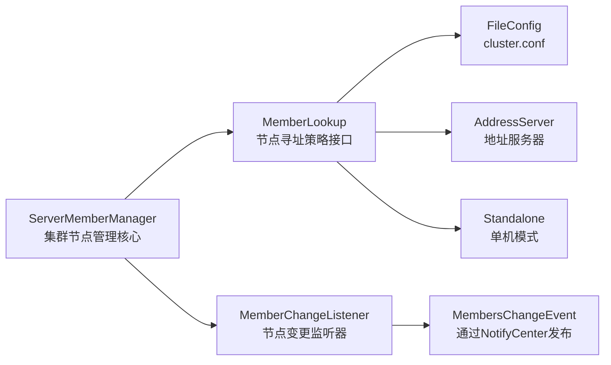
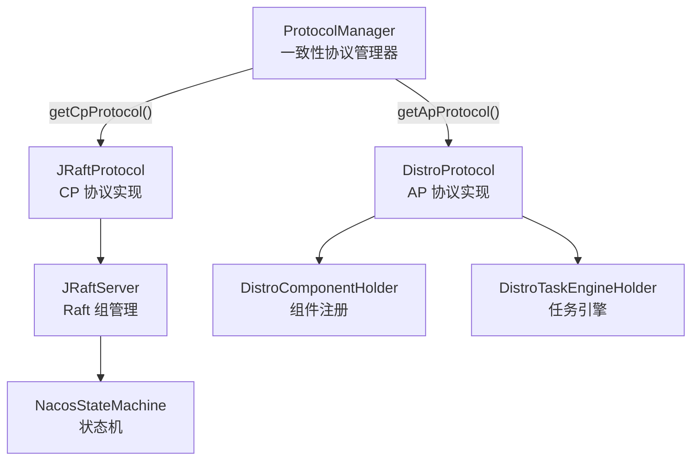

# Nacos Core 模块源码详解

> 共 **284 个 Java 源文件**，包路径 `com.alibaba.nacos.core.*`，是 Nacos 服务端的**中枢模块**。

---

## 一、模块总览

`core` 是 Nacos 的"内核"，承载以下核心职责：

| 职责 | 对应子包 | 一句话 |
|------|----------|--------|
| **集群管理** | `cluster/` | 节点发现、成员变更、健康检查 |
| **启动生命周期** | `listener/startup/` | 分阶段启动（core → web → console → ai） |
| **一致性协议** | `distributed/` | JRaft（CP）+ Distro（AP）双协议管理 |
| **远程通信** | `remote/` | gRPC 服务器、连接管理、推送服务 |
| **认证鉴权** | `auth/` | HTTP + gRPC 双通道认证过滤器 |
| **命名空间** | `namespace/` | 多租户隔离的命名空间 CRUD |
| **插件管理** | `plugin/` | 统一插件生命周期管理（Raft 同步） |
| **参数校验** | `paramcheck/` | HTTP/gRPC 请求参数的提取与校验 |
| **TPS 流控** | `control/` | HTTP/gRPC 双通道 TPS 限流 |
| **监控指标** | `monitor/` | gRPC 线程池、连接数、TopN 统计 |
| **Web 基础设施** | `web/`, `context/`, `code/` | 请求上下文、Controller 缓存、表单拦截 |
| **运维 API** | `controller/v3/` | 集群/命名空间/插件/状态管理 HTTP 接口 |
| **持久化** | `persistence/` | Derby 快照、分布式数据库操作 |
| **能力协商** | `ability/` | 服务端能力初始化和控制 |

---

## 二、逐包子包详解

### 2.1 `cluster/` — 集群管理（9 个类 + 子包）



| 类名 | 类型 | 作用 |
|------|------|------|
| `ServerMemberManager` | class | **集群管理核心**：初始化寻址、维护成员列表、处理节点加入/离开、健康检查。通过 `NotifyCenter` 发布 `MembersChangeEvent` |
| `Member` | class | 集群节点模型：IP、端口、扩展属性（RAFT_PORT 等）、健康状态 |
| `MemberLookup` | interface | 节点寻址策略接口，定义 `start()`、`injectMemberManager()` 等方法 |
| `AbstractMemberLookup` | abstract class | 寻址策略基类，提供 `afterLookup()` 回调 |
| `FileConfigMemberLookup` | class | 通过 `cluster.conf` 文件配置集群成员 |
| `AddressServerMemberLookup` | class | 通过地址服务器动态发现集群成员 |
| `StandaloneMemberLookup` | class | 单机模式：只有自己一个成员 |
| `LookupFactory` | enum | 寻址策略工厂，根据配置创建对应的 `MemberLookup` |
| `MemberUtil` | class | 成员工具类：计算 RAFT 端口、解析地址、序列化/反序列化 |
| `MemberMetaDataConstants` | class | 成员元数据常量（RAFT_PORT、WEIGHT 等） |
| `MemberChangeListener` | abstract class | 节点变更监听器，实现 `NotifyCenter` 的 `Subscriber`，供 `ProtocolManager` 继承 |
| `MembersChangeEvent` | class | 节点列表变更事件，通过 `NotifyCenter` 发布 |
| `NacosMemberManager` | interface | 成员管理器接口 |
| `Task` | class | 简单任务封装 |

**子包：**

| 子包 | 类 | 作用 |
|------|-----|------|
| `cluster/health/` | `AbstractModuleHealthChecker` | 模块健康检查基类 |
| | `ModuleHealthCheckerHolder` | 健康检查器持有者（SPI） |
| | `ReadinessResult` | 就绪检查结果模型 |
| `cluster/lookup/` | (已在上面列出) | 寻址策略实现 |
| `cluster/remote/` | `ClusterRpcClientProxy` | 集群间 RPC 客户端代理，向其他节点发送请求 |
| | `MemberReportHandler` | 处理成员上报请求 |
| `cluster/remote/request/` | `AbstractClusterRequest` | 集群请求基类 |
| | `MemberReportRequest` | 成员上报请求 |
| | `PluginAvailabilityRequest` | 查询插件在目标节点是否可用 |
| | `PluginAvailabilityRequestHandler` | 处理插件可用性查询 |
| `cluster/remote/response/` | `MemberReportResponse` | 成员上报响应 |
| | `PluginAvailabilityResponse` | 插件可用性响应 |

---

### 2.2 `listener/` + `listener/startup/` — 启动生命周期（9 个类）

**这是 Nacos 分阶段启动的核心机制。**

```
NacosBootstrap.main()
    └─ NacosStartUpManager.start("core");      // 阶段1：核心
    │       └─ NacosCoreStartUp
    │           ├─ 创建日志目录
    │           ├─ 初始化 NotifyCenter
    │           ├─ 初始化集群通信（ServerMemberManager）
    │           └─ 初始化一致性协议（ProtocolManager）
    │
    └─ NacosStartUpManager.start("web");       // 阶段2：Web 层
    │       └─ NacosWebStartUp
    │           ├─ 启动 gRPC Server（GrpcSdkServer + GrpcClusterServer）
    │           └─ 初始化 Web 容器
    │
    └─ NacosStartUpManager.start("console");   // 阶段3：控制台
    │       └─ (console 模块专属)
    │
    └─ NacosStartUpManager.start("ai-registry"); // 阶段4：AI 注册
            └─ (ai-registry-adaptor 模块专属)
```

| 类名 | 类型 | 作用 |
|------|------|------|
| `NacosStartUp` | interface | 启动阶段接口，定义 `startUpPhase()`、`starting()`、`started()`、`failed()` 生命周期方法。常量：`CORE_START_UP_PHASE`、`WEB_START_UP_PHASE`、`CONSOLE_START_UP_PHASE`、`AI_REGISTRY_START_UP_PHASE` |
| `NacosStartUpManager` | class | **启动阶段管理器（单例）**：通过 SPI 加载所有 `NacosStartUp` 实现，按 `phase` 名称执行启动。`start(phase)` 触发阶段，`getReverseStartedList()` 用于优雅停机 |
| `AbstractNacosStartUp` | abstract class | 启动阶段抽象基类，提供默认空实现 |
| `NacosCoreStartUp` | class | Core 阶段：创建日志目录、初始化系统属性、启动一致性协议 |
| `NacosWebStartUp` | class | Web 阶段：创建 Web 工作目录、启动 gRPC 服务器 |
| `NacosApplicationListener` | interface | 自定义 ApplicationListener 接口（配合 Spring 启动流程） |
| `LoggingApplicationListener` | class | 初始化日志配置 |
| `StartingApplicationListener` | class | 初始化环境配置 |
| `StandaloneProfileApplicationListener` | class | 单机模式自动激活 `standalone` profile |

---

### 2.3 `distributed/` — 一致性协议（23+ 个类）

核心架构：`ProtocolManager` 管理 AP（Distro）和 CP（JRaft）双协议。



#### 顶层

| 类名 | 类型 | 作用 |
|------|------|------|
| `ProtocolManager` | class | **一致性协议管理器**：懒加载 CP/AP 协议，监听 `MembersChangeEvent` 自动通知协议层成员变更。`@Component` 注册为 Spring Bean |
| `AbstractConsistencyProtocol` | abstract class | 一致性协议基类 |
| `ConsistencyConfiguration` | class | 一致性协议配置类（Spring `@Configuration`） |
| `ProtocolExecutor` | class | 协议执行器（线程池隔离） |

#### `distributed/distro/` — AP 协议（Distro）

| 类名 | 类型 | 作用 |
|------|------|------|
| `DistroProtocol` | class | **Distro 协议核心**：管理数据同步、校验任务 |
| `DistroConfig` | class | Distro 配置（同步超时、重试次数等） |
| `DistroConstants` | class | Distro 常量定义 |

**`distro/component/`** — 组件抽象

| 类名 | 类型 | 作用 |
|------|------|------|
| `DistroComponentHolder` | class | **组件注册中心**：持有所有 `DistroDataProcessor`、`DistroDataStorage`、`DistroTransportAgent`、`DistroFailedTaskHandler` |
| `DistroCallback` | interface | Distro 回调接口 |
| `DistroDataProcessor` | interface | 数据处理接口：`processType()` + `processData()` |
| `DistroDataStorage` | interface | 数据存储接口：`getAllDistroKeys()` + `getDistroData()` |
| `DistroTransportAgent` | interface | 数据传输接口：`syncData()` |
| `DistroFailedTaskHandler` | interface | 失败任务处理接口 |

**`distro/entity/`** — 数据模型

| 类名 | 类型 | 作用 |
|------|------|------|
| `DistroData` | class | Distro 同步数据包（key + content + type） |
| `DistroKey` | class | Distro 数据键（resourceType + resourceKey + targetServer） |

**`distro/task/`** — 任务引擎

| 类名 | 类型 | 作用 |
|------|------|------|
| `DistroTaskEngineHolder` | class | 任务引擎持有者：持有 delay 和 execute 两个执行引擎 |
| `DistroDelayTask` | class | 延迟任务模型 |
| `DistroDelayTaskExecuteEngine` | class | 延迟任务执行引擎（定时批量处理） |
| `DistroDelayTaskProcessor` | class | 延迟任务处理器 |
| `AbstractDistroExecuteTask` | abstract class | 执行任务抽象基类 |
| `DistroExecuteTaskExecuteEngine` | class | 执行任务引擎 |
| `DistroSyncChangeTask` | class | 同步变更任务 |
| `DistroSyncDeleteTask` | class | 同步删除任务 |
| `DistroLoadDataTask` | class | 全量数据加载任务（节点加入时触发） |
| `DistroVerifyExecuteTask` | class | 数据校验任务 |
| `DistroVerifyTimedTask` | class | 定时触发校验任务 |
| `DistroException` | class | Distro 异常 |
| `DistroRecord` / `DistroRecordsHolder` | class | Distro 监控记录 |

#### `distributed/raft/` — CP 协议（JRaft）

| 类名 | 类型 | 作用 |
|------|------|------|
| `JRaftProtocol` | class | **JRaft 协议实现**：`init()` 中为每个 LogProcessor 创建独立的 Raft Group，每个业务模块有自己的状态机 |
| `JRaftServer` | class | JRaft 服务器实例（脱离 Spring IOC 管理），管理多个 Raft Group |
| `RaftConfig` | class | Raft 配置（选举超时、快照间隔等） |
| `NacosStateMachine` | class | Nacos 状态机，处理 Raft Log 的应用 |
| `RaftEvent` | class | Raft 协议运行中的元数据变更事件 |
| `NacosClosure` | class | 实现 JRaft Closure 回调 |
| `JSnapshotOperation` | class | 快照操作接口 |
| `RaftSysConstants` | class | Raft 系统常量 |
| `JRaftMaintainService` | class | JRaft 运维接口 |
| `RaftExecutor` | class | Raft 专用线程池 |
| `RaftOptionsBuilder` | class | 构建 JRaft `RaftOptions` |
| `JRaftUtils` | class | JRaft 工具类 |

**`raft/processor/`**

| 类名 | 类型 | 作用 |
|------|------|------|
| `AbstractProcessor` | abstract class | RPC 处理器基类 |
| `NacosReadRequestProcessor` | class | 处理 `ReadRequest`（读操作） |
| `NacosWriteRequestProcessor` | class | 处理 `WriteRequest`（写操作） |

**`raft/exception/`**

| 类名 | 作用 |
|------|------|
| `DuplicateRaftGroupException` | 创建重复 Raft Group 时抛出 |
| `JRaftException` | JRaft 通用异常 |
| `NoLeaderException` | 当前 Raft Group 无 Leader 时抛出 |
| `NoSuchRaftGroupException` | Raft Group 不存在时抛出 |

#### `distributed/id/`

| 类名 | 类型 | 作用 |
|------|------|------|
| `IdGeneratorManager` | class | ID 生成器管理器 |
| `SnowFlowerIdGenerator` | class | 雪花算法 ID 生成器（WorkerId 通过 InetAddress hash 计算） |

---

### 2.4 `remote/` — 远程通信（30+ 个类）

Nacos 的通信层，基于 gRPC 实现，分为 **SDK 通道**（客户端↔服务端）和 **Cluster 通道**（服务端节点间）。

#### 顶层

| 类名 | 类型 | 作用 |
|------|------|------|
| `BaseRpcServer` | abstract class | **RPC 服务器抽象基类**：定义启动、关闭、连接管理等 |
| `Connection` | class | 连接抽象模型：`connectionId`、`MetaInfo`、`isConnected()` |
| `ConnectionMeta` | class | 连接元数据：clientIp、appName、labels、source 等 |
| `ConnectionManager` | class | **连接管理器**：注册/注销连接、按 IP 统计连接数、连接数限流（通过 ControlPlugin 校验）、触发 `ClientConnectionEventListener` |
| `ClientConnectionEventListener` | class | 客户端连接事件监听器：`clientConnected()` / `clientDisConnected()` |
| `ClientConnectionEventListenerRegistry` | class | 连接事件监听器注册表 |
| `RequestHandler` | class | **请求处理器抽象**：定义 `handle()` 方法 |
| `RequestHandlerRegistry` | class | 请求处理器注册表 |
| `RequestFilters` | class | 请求过滤器链 |
| `AbstractRequestFilter` | abstract class | 请求拦截器基类 |
| `RpcPushService` | class | **推送服务**：向客户端推送响应 |
| `RpcAckCallbackSynchronizer` | class | 推送 Ack 回调同步器 |
| `RuntimeConnectionEjector` | interface | 连接驱逐器接口 |
| `NacosRuntimeConnectionEjector` | class | 运行时连接驱逐器 |
| `HealthCheckRequestHandler` | class | 处理客户端健康检查请求 |
| `LongConnectionMetricsCollector` | class | 长连接指标收集器 |

#### `remote/core/`

| 类名 | 作用 |
|------|------|
| `RpcAckCallbackInitorOrCleaner` | 推送 Ack 回调的初始化/清理 |
| `ServerLoaderInfoRequestHandler` | 处理 Server Loader 信息查询 |
| `ServerReloaderRequestHandler` | 处理 Server 重载请求 |

#### `remote/event/`

| 类名 | 作用 |
|------|------|
| `RemotingHeartBeatEvent` | 心跳事件 |

#### `remote/grpc/` — gRPC 实现

| 类名 | 类型 | 作用 |
|------|------|------|
| `BaseGrpcServer` | class | **gRPC 服务器基类**：启动 Netty gRPC 服务、绑定端口 |
| `GrpcSdkServer` | class | **SDK 通道 gRPC 服务器**（客户端连接，默认端口 +1000） |
| `GrpcClusterServer` | class | **集群通道 gRPC 服务器**（节点间通信，默认端口 +1001） |
| `GrpcConnection` | class | gRPC 连接实现，封装 `StreamObserver` |
| `GrpcRequestAcceptor` | class | gRPC 请求接收器（处理 Unary 调用） |
| `GrpcBiStreamRequestAcceptor` | class | gRPC 双向流请求接收器（处理 BiDiStream） |
| `GrpcConnectionInterceptor` | class | gRPC 连接拦截器 |
| `ConnectionGeneratorService` | interface | 连接 ID 生成服务接口 |
| `ConnectionGeneratorServiceImpl` | class | 连接 ID 生成默认实现 |
| `ConnectionGeneratorServiceDelegate` | class | 连接 ID 生成服务代理 |
| `AddressTransportFilter` | class | 地址传输过滤器（处理 remote/local address） |
| `PushAckIdGenerator` | class | 推送 Ack ID 生成器 |
| `RemoteParamCheckFilter` | class | 远程参数校验过滤器 |
| `GrpcServerConstants` | class | gRPC 服务器常量（端口偏移等） |
| `InvokeSource` | interface | 调用来源注解 |

**`grpc/filter/`**

| 类名 | 作用 |
|------|------|
| `NacosGrpcServerTransportFilter` | gRPC 传输层过滤器接口 |
| `NacosGrpcServerTransportFilterServiceLoader` | SPI 加载器 |

**`grpc/interceptor/`**

| 类名 | 作用 |
|------|------|
| `NacosGrpcServerInterceptor` | gRPC 服务器拦截器接口 |
| `NacosGrpcServerInterceptorServiceLoader` | SPI 加载器 |

**`grpc/negotiator/`** — TLS 协议协商

| 类名 | 类型 | 作用 |
|------|------|------|
| `ProtocolNegotiatorBuilder` | interface | 协议协商构建器接口 |
| `AbstractProtocolNegotiatorBuilderSingleton` | abstract class | 构建器单例基类 |
| `ClusterProtocolNegotiatorBuilderSingleton` | class | 集群通道 TLS 协商器构建器单例 |
| `SdkProtocolNegotiatorBuilderSingleton` | class | SDK 通道 TLS 协商器构建器单例 |
| `NacosGrpcProtocolNegotiator` | interface | Nacos gRPC 协议协商器 |
| `ClusterDefaultTlsProtocolNegotiatorBuilder` | class | 集群默认 TLS 协商器 |
| `SdkDefaultTlsProtocolNegotiatorBuilder` | class | SDK 默认 TLS 协商器 |
| `DefaultTlsContextBuilder` | class | SSL 上下文构建器 |
| `OptionalTlsProtocolNegotiator` | class | 支持 TLS + Plain 同端口复用 |

#### `remote/tls/`

| 类名 | 类型 | 作用 |
|------|------|------|
| `RpcServerTlsConfig` | class | RPC 服务器 TLS 配置 |
| `RpcServerTlsConfigFactory` | class | TLS 配置工厂 |
| `RpcServerSslContextRefresher` | interface | SSL 上下文刷新器 SPI |
| `RpcServerSslContextRefresherHolder` | class | SSL 上下文刷新器持有者 |
| `SslContextChangeAware` | interface | SSL 上下文变更感知接口 |

---

### 2.5 `auth/` — 认证鉴权（9 个类）

双通道认证：HTTP Filter + gRPC Interceptor。

| 类名 | 类型 | 作用 |
|------|------|------|
| `AbstractWebAuthFilter` | abstract class | **鉴权过滤器抽象基类**：定义 `authenticate()` 和 `authorize()` 模板方法 |
| `AuthFilter` | class | **客户端 HTTP API 鉴权过滤器**（`/v3/client/**`） |
| `AuthAdminFilter` | class | **管理端 HTTP API 鉴权过滤器**（`/v3/admin/**`） |
| `RemoteRequestAuthFilter` | class | **gRPC 请求鉴权过滤器**：解析 gRPC metadata 中的身份信息 |
| `AuthConfig` | class | 鉴权配置类（开关、Token 密钥等） |
| `NacosServerAuthConfig` | class | 服务端鉴权配置（客户端 API 相关） |
| `NacosServerAdminAuthConfig` | class | 管理端鉴权配置（管理 API 相关） |
| `AuthModuleStateBuilder` | class | 鉴权模块状态构建器 |
| `InnerApiAuthEnabled` | class | **内部 API 鉴权开关**：用于 2.x → 3.x 升级期间的兼容过渡。检测集群节点是否都升级到支持身份头的版本后才启用内部 API 鉴权 |

---

### 2.6 `namespace/` — 命名空间管理（11 个类）

多租户隔离的核心。

| 类名 | 类型 | 作用 |
|------|------|------|
| `NamespacePersistService` | interface | 命名空间持久化服务接口 |
| `EmbeddedNamespacePersistServiceImpl` | class | **内嵌模式**（Derby）持久化实现 |
| `ExternalNamespacePersistServiceImpl` | class | **外接数据库**（MySQL/PostgreSQL）持久化实现 |
| `TenantInfo` | class | 租户信息模型（旧称 Tenant，新称 Namespace） |
| `NamespaceTypeEnum` | enum | 命名空间类型枚举（GLOBAL / CUSTOM） |
| `NamespaceForm` | class | 命名空间表单基类 |
| `CreateNamespaceForm` | class | 创建命名空间表单（扩展 `NamespaceForm`） |
| `NamespaceRowMapperInjector` | class | 行映射注入器 |
| `NamespaceValidation` | interface | 命名空间校验注解 |
| `NamespaceValidationConfig` | class | 命名空间校验配置（默认关闭） |
| `NamespaceValidationRequestFilter` | class | 命名空间校验请求过滤器 |
| `AbstractNamespaceDetailInjector` | class | 命名空间详情注入器基类 |
| `NamespaceDetailInjectorHolder` | class | 注入器持有者（SPI） |

---

### 2.7 `plugin/` — 插件管理（17 个类）

3.2.0 引入的统一插件管理系统，支持插件状态通过 Raft 在集群间同步。

| 类名 | 类型 | 作用 |
|------|------|------|
| `PluginManager` | class | **统一插件管理器**：`ApplicationReadyEvent` 时扫描所有 `PluginProvider`（SPI），管理插件注册表、启用/禁用状态、配置项。实现 `PluginStateChecker` + `PluginStateApplier` |
| `PluginStateProcessor` | class | 插件状态的 Raft 处理器，用 CP 协议在集群间复制状态变更 |
| `PluginStateSnapshotOperation` | class | 插件状态快照操作（Raft 恢复用） |
| `CriticalPluginConfig` | class | 关键插件配置（不能被禁用的插件列表） |

**`plugin/model/`** — 数据模型

| 类名 | 作用 |
|------|------|
| `PluginInfo` | 插件信息模型 |
| `PluginStateOperation` | 插件状态操作（用于 Raft 复制） |
| `PluginStateSnapshot` | 插件状态快照 |
| `PluginConfigForm` | 插件配置更新表单 |
| `PluginStatusForm` | 插件状态更新表单 |
| `PluginDetailVO` | 插件详情 VO |
| `PluginInfoVO` | 插件列表 VO |

**`plugin/storage/`** — 持久化

| 类名 | 类型 | 作用 |
|------|------|------|
| `PluginStatePersistenceService` | interface | 插件状态持久化接口 |
| `FilePluginStatePersistenceImpl` | class | **文件持久化**：存为 JSON 于 `{NACOS_HOME}/data/plugin/` |
| `PluginPersistenceException` | class | 持久化异常 |

**`plugin/sync/`** — 集群同步

| 类名 | 类型 | 作用 |
|------|------|------|
| `PluginStateSynchronizer` | interface | 同步策略接口 |
| `PluginStateApplier` | interface | 状态应用接口 |
| `RaftPluginStateSynchronizer` | class | **Raft 同步**（集群模式）：通过 CPProtocol 在集群节点间同步 |
| `StandalonePluginStateSynchronizer` | class | **单机同步**（单机模式）：仅本地持久化 |

**`plugin/condition/`** — 条件注解

| 类名 | 作用 |
|------|------|
| `ConditionOnClusterMode` | 集群模式下才激活 Bean |
| `ConditionOnStandaloneMode` | 单机模式下才激活 Bean |

---

### 2.8 `paramcheck/` — 参数校验（19 个类）

对 HTTP 和 gRPC 请求做参数提取和校验。

| 类名 | 类型 | 作用 |
|------|------|------|
| `ParamExtractor` | interface | 参数提取器接口 |
| `AbstractHttpParamExtractor` | abstract class | HTTP 请求参数提取器基类 |
| `AbstractRpcParamExtractor` | abstract class | gRPC 请求参数提取器基类 |
| `ExtractorManager` | class | 提取器管理器 |
| `ParamCheckerFilter` | class | **HTTP 参数校验过滤器** |
| `CheckConfiguration` | class | 校验配置注册 |
| `ServerParamCheckConfig` | class | 参数校验配置 |

**`paramcheck/impl/`** — 12 种具体提取器

| 类名 | 对应请求 |
|------|----------|
| `ConfigRequestParamExtractor` | 配置请求 `AbstractConfigRequest` |
| `ConfigBatchListenRequestParamExtractor` | 配置批量监听请求 |
| `ConfigFuzzyWatchRequestParamsExtractor` | 配置模糊 Watch 请求 |
| `InstanceRequestParamExtractor` | 实例请求 `InstanceRequest` |
| `BatchInstanceRequestParamExtractor` | 批量实例请求 |
| `PersistentInstanceRequestParamExtractor` | 持久化实例请求 |
| `ServiceListRequestParamExtractor` | 服务列表请求 |
| `ServiceQueryRequestParamExtractor` | 服务查询请求 |
| `SubscribeServiceRequestParamExtractor` | 服务订阅请求 |
| `AgentRequestParamExtractor` | A2A Agent 请求 |
| `McpServerRequestParamExtractor` | MCP Server 请求 |
| `PromptRequestParamExtractor` | Prompt 请求 |

---

### 2.9 `control/` — TPS 流控（8 个类）

对 HTTP 和 gRPC 请求做 TPS 限流。

#### 顶层

| 类名 | 类型 | 作用 |
|------|------|------|
| `TpsControl` | interface | TPS 控制管理器接口 |
| `TpsControlConfig` | class | TPS 控制配置 |
| `SpringValueConfigsInitializer` | class | Spring 值配置初始化器 |

#### `control/http/`

| 类名 | 作用 |
|------|------|
| `HttpTpsCheckRequestParser` | HTTP TPS 检查请求解析器接口 |
| `HttpTpsCheckRequestParserRegistry` | HTTP 解析器注册表 |
| `HttpTpsPointRegistry` | HTTP TPS 埋点注册表 |
| `NacosHttpTpsControlRegistration` | HTTP TPS 控制切面注册 |
| `NacosHttpTpsFilter` | HTTP TPS 控制过滤器 |

#### `control/remote/`

| 类名 | 作用 |
|------|------|
| `RemoteTpsCheckRequestParser` | gRPC TPS 检查请求解析器接口 |
| `RemoteTpsCheckRequestParserRegistry` | gRPC 解析器注册表 |
| `TpsControlRequestFilter` | gRPC TPS 控制过滤器 |

---

### 2.10 `controller/v3/` — 运维 API（6 个 Controller）

| 类名 | 作用 |
|------|------|
| `CoreOpsControllerV3` | **核心运维 HTTP 接口 v3**：日志级别动态修改、Raft 操作等 |
| `NacosClusterControllerV3` | **集群通信接口 v3**：集群节点查询、寻址模式切换 |
| `NamespaceControllerV3` | **命名空间管理接口 v3**：命名空间 CRUD |
| `PluginControllerV3` | **插件管理接口 v3**：插件列表、启用/禁用、配置查询 |
| `ServerLoaderControllerV3` | **Server Loader 控制接口 v3** |
| `ServerStateController` | **服务状态接口**：健康检查、就绪检查 |

---

### 2.11 其他子包

#### `ability/` — 能力协商

| 类名 | 类型 | 作用 |
|------|------|------|
| `ServerAbilityInitializer` | interface | 服务端能力初始化器 SPI |
| `ServerAbilityInitializerHolder` | class | SPI 持有者 |
| `RemoteAbilityInitializer` | class | 远程能力初始化器 |
| `AbilityConfigs` | class | 能力配置 |
| `ServerAbilityControlManager` | class | 能力控制管理器 |

#### `code/` — Spring 增强

| 类名 | 作用 |
|------|------|
| `ControllerMethodsCache` | **Controller 方法缓存**：扫描所有 `@RequestMapping`，建立路径→方法的映射 |
| `RequestMappingInfo` | 请求映射信息（路径 + 方法匹配） |
| `SpringApplicationRunListener` | Spring Boot 启动监听器 |
| `ParamRequestCondition` | 请求参数条件 |
| `PathRequestCondition` | 请求路径条件 |

#### `config/` — 动态配置

| 类名 | 作用 |
|------|------|
| `AbstractDynamicConfig` | 动态配置抽象基类 |
| `DistroModuleStateBuilder` | Distro 模块状态构建器 |
| `RaftModuleStateBuilder` | Raft 模块状态构建器 |

#### `console/` — 控制台提示

| 类名 | 作用 |
|------|------|
| `ConsolePathTipConfig` | 控制台路径提示配置 |
| `NacosConsolePathTipFilter` | 控制台路径提示过滤器（访问非控制台路径时返回 404 并提示） |

#### `context/` — 请求上下文

| 类名 | 作用 |
|------|------|
| `RequestContext` | Nacos 请求上下文（ThreadLocal） |
| `RequestContextHolder` | 每个工作线程持有独立 RequestContext |
| `BasicContext` | 基础信息上下文（namespace、group 等） |
| `AddressContext` | 地址信息上下文（remoteIp、localIp） |
| `AuthContext` | 鉴权上下文（用户、角色等） |
| `EngineContext` | 引擎上下文（版本、系统信息） |
| `HttpRequestContextFilter` | HTTP 请求上下文注入 Filter |
| `HttpRequestContextConfig` | HTTP 请求上下文配置 |

#### `exception/`

| 类名 | 作用 |
|------|------|
| `ErrorCode` | Core 模块错误码枚举（40001 起） |
| `KvStorageException` | KV 存储异常 |
| `NacosApiExceptionHandler` | Nacos API 异常全局处理器 |

#### `monitor/` — 监控指标

| 类名 | 作用 |
|------|------|
| `GrpcServerThreadPoolMonitor` | gRPC 服务器线程池指标收集 |
| `MetricsMonitor` | 指标监控器 |
| `NacosMeterRegistryCenter` | Micrometer 注册中心 |
| `BaseTopNCounter` | TopN 计数器基类 |
| `StringTopNCounter` | 字符串 TopN 计数器 |
| `FixedSizePriorityQueue` | 定长优先队列 |
| `TopNConfig` | TopN 配置 |

#### `persistence/`

| 类名 | 作用 |
|------|------|
| `DistributedDatabaseOperateImpl` | **分布式数据库操作**：通过 JRaft 实现分布式一致性写入，集成 `JRaftProtocol` 和 JdbcTemplate |
| `DerbySnapshotOperation` | Derby 快照操作 |

#### `service/`

| 类名 | 作用 |
|------|------|
| `NacosClusterOperationService` | 集群运维服务 |
| `NacosServerLoaderService` | Server Loader 服务 |
| `NacosServerStateService` | 服务状态服务 |
| `NamespaceOperationService` | 命名空间运维服务 |

#### `trace/`

| 类名 | 作用 |
|------|------|
| `NacosCombinedTraceSubscriber` | 组合 Trace 事件订阅器 |

#### `web/`

| 类名 | 类型 | 作用 |
|------|------|------|
| `NacosWebBean` | annotation | **`@NacosWebBean` 注解**：标记强制依赖 Web 容器的自定义 Bean |
| `NacosCoreWebConfiguration` | class | Core Web 层配置 |
| `NacosWebServerListener` | class | Web 服务器监听器（监听容器就绪和 contextPath 变更） |
| `FormSizeFilter` | class | 表单大小限制过滤器（解决 [#14423](https://github.com/alibaba/nacos/issues/14423)） |

#### `utils/` — 工具类

| 类名 | 作用 |
|------|------|
| `ClassUtils` | 类工具（泛型解析等） |
| `Commons` | 公共常量 |
| `GenericType` | 泛型获取封装 |
| `GlobalExecutor` | 全局线程池 |
| `Loggers` | Core 日志门面 |
| `PageUtil` | 分页工具 |
| `RemoteUtils` | 远程通信工具 |
| `WebUtils` | Web 工具 |
| `StringPool` | 字符串池（减少内存分配） |
| `ReuseHttpRequest` | 可复用的 HTTP 请求接口 |
| `ReuseHttpServletRequest` | 可复用的 HttpServletRequest 包装器 |
| `ReuseUploadFileHttpServletRequest` | 可复用的文件上传请求包装器 |
| `OverrideParameterRequestWrapper` | 参数覆写请求包装器 |

#### `io/grpc/netty/shaded/`（1 个类）

| 类名 | 作用 |
|------|------|
| `NettyChannelHelper` | 获取 Netty Channel（解决 gRPC shaded 包的兼容问题） |

---

## 三、架构总结

```
┌─────────────────────────────────────────────────────────┐
│                     Core 模块全景                          │
├─────────────────────────────────────────────────────────┤
│                                                          │
│  ┌──────────┐  ┌──────────┐  ┌───────────────┐          │
│  │ 启动生命周期│  │ 集群管理  │  │ 一致性协议      │          │
│  │ NacosStart│  │ Server   │  │ ProtocolManager│          │
│  │ UpManager │  │ Member   │  │ AP:Distro      │          │
│  │ 4个Phase  │  │ Manager  │  │ CP:JRaft       │          │
│  └──────────┘  └──────────┘  └───────────────┘          │
│                                                          │
│  ┌──────────────────────────────────────┐                │
│  │         远程通信层 remote/            │                │
│  │  GrpcSdkServer  │  GrpcClusterServer  │                │
│  │  ConnectionManager │ RpcPushService   │                │
│  │  RequestHandler  │  TLS协商           │                │
│  └──────────────────────────────────────┘                │
│                                                          │
│  ┌──────────┐ ┌──────────┐ ┌──────────┐                │
│  │ 认证鉴权  │ │ TPS 流控 │ │ 参数校验  │                │
│  │ auth/    │ │ control/ │ │ paramcheck│                │
│  └──────────┘ └──────────┘ └──────────┘                │
│                                                          │
│  ┌──────────┐ ┌──────────────┐ ┌──────────┐            │
│  │ 命名空间  │ │ 插件管理      │ │ 运维 API  │            │
│  │ namespace│ │ plugin/      │ │ controller│            │
│  └──────────┘ └──────────────┘ └──────────┘            │
│                                                          │
│  ┌──────────────────────────────────────┐                │
│  │      基础设施: 监控/持久化/上下文/工具    │                │
│  └──────────────────────────────────────┘                │
└─────────────────────────────────────────────────────────┘
```

**Core 模块的依赖关系**（内部 nacos-* 依赖）：

```
core 依赖:
  ├── auth       (认证授权)
  ├── common     (NotifyCenter、工具类)
  ├── config-plugin  (配置变更 SPI)
  ├── consistency    (CP/AP 协议抽象)
  ├── control-plugin (流控 SPI)
  ├── custom-environment-plugin
  ├── datasource-plugin
  ├── encryption-plugin
  ├── persistence    (数据持久化)
  └── trace-plugin
```
